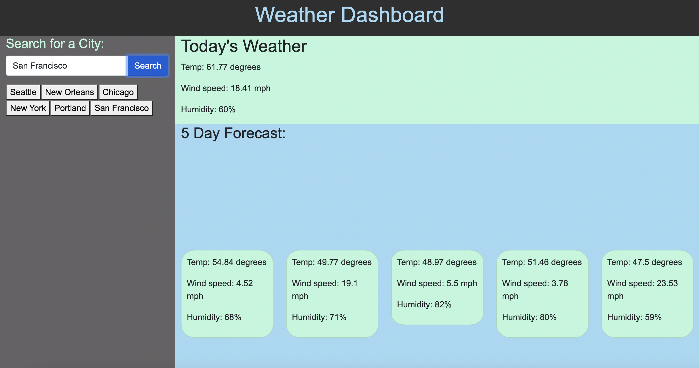

# Weather-Dash

## Description

This is a weather dashboard that provides the user with the 
current weather and 5-day forecast, including general weather conditions; temperature; wind speed; and humidity. The website 
will provide the user with this information upon the desired city
being entered into the search bar. 

This site uses the OpenWeather API to retrieve current weather details, and also utilizes local storage to save past searches.

## Installation

Site deployed. URL: https://andreaginn.github.io/Weather-Dash/

